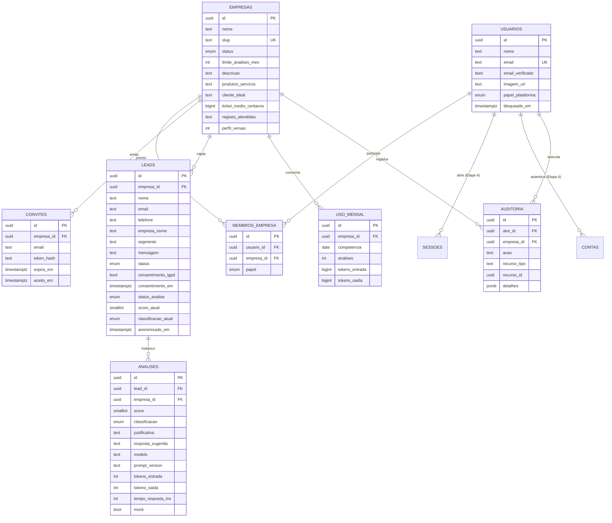
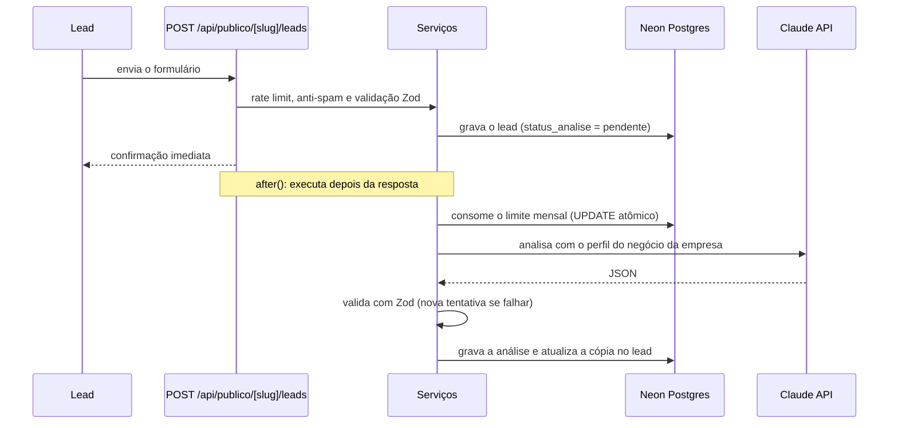
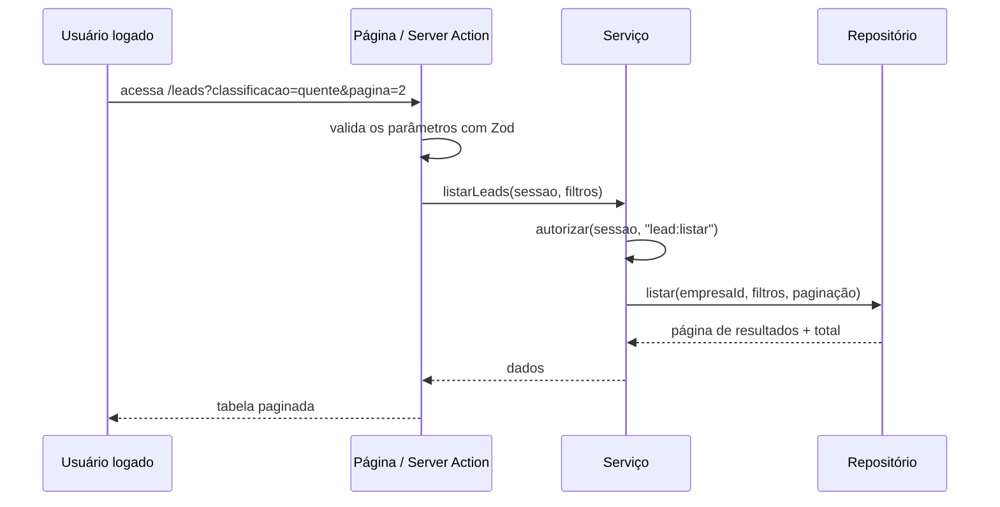

# Arquitetura do LeadScore IA

Documento de referência da arquitetura aprovada na Etapa 1 (24/09/2026).
As justificativas de cada escolha estão em [decisoes.md](decisoes.md).

## 1. Visão geral

SaaS multiempresa de qualificação de leads. Cada empresa cliente tem um
formulário público de captação; quando um lead o preenche, a Claude API avalia
o contato com base no perfil do negócio daquela empresa e devolve nota (0 a 100),
classificação (quente, morno, frio), justificativa e uma resposta sugerida.

```
 Lead (público)                 Vendedor / admin / suporte
   │  /f/[slug]                    │  /painel, /leads, /admin...
   ▼                               ▼
 ┌─────────────── Vercel (gru1, São Paulo) ── Next.js 16 ───────────────┐
 │ proxy.ts            → sessão obrigatória + cabeçalhos de segurança    │
 │ app/ (UI)           → páginas, server actions, route handlers (finos) │
 │ server/services     → regras de negócio + RBAC + auditoria            │
 │ server/repositories → Drizzle; toda função exige empresaId            │
 │ lib/ia, lib/email, lib/rate-limit, lib/armazenamento → adaptadores    │
 └──────────────┬──────────────────────────────────┬─────────────────────┘
                ▼                                  ▼
       Neon Postgres (sa-east-1)          Claude API (Haiku 4.5) | mock
```

### Camadas e responsabilidades

| Camada | Pasta | Pode | Não pode |
|---|---|---|---|
| Interface | `src/app`, `src/components` | Validar entrada com Zod, chamar serviços, renderizar | Acessar o banco, conter regra de negócio |
| Serviços (casos de uso) | `src/server/services` | Verificar permissão (RBAC), aplicar regras, registrar auditoria | Conhecer detalhes de HTTP ou de interface |
| Repositórios | `src/server/repositories` | Consultar o banco via Drizzle, sempre filtrando `empresa_id` e `deleted_at` | Decidir permissões |
| Adaptadores | `src/lib/*` | Falar com serviços externos (IA, e-mail, arquivos, rate limit) | Conter regra de negócio |

Todo código de servidor importa `server-only`: se alguém o importar num
componente de cliente, o build falha.

### Onde fica cada tipo de endpoint

- **Server Actions**: mutações do painel autenticado (alterar status, editar
  empresa etc.). Cada action é um endpoint público, então **toda** action
  verifica sessão e permissão no serviço.
- **Route Handlers** (`src/app/api/`): formulário público, `POST /api/analisar/[leadId]`,
  exportação CSV em streaming e rotas da autenticação.

## 2. Estrutura de pastas

```
src/
  app/
    (publico)/        login, cadastro, redefinir-senha, politica-de-privacidade
    f/[slug]/         formulário público de captação
    onboarding/       cadastro da empresa e do perfil do negócio
    (painel)/         layout: menu lateral por perfil + topo com avatar
      painel/  leads/  leads/[id]/  configuracoes/  usuarios/  perfil/
      admin/empresas/  admin/usuarios/  admin/auditoria/
    api/              auth/[...all], publico/[slug]/leads, analisar/[leadId], leads/exportar
  server/
    services/         casos de uso (criarLead, analisarLead, anonimizarLead...)
    repositories/     consultas Drizzle (empresaId obrigatório, sem deletados, paginadas)
    auth/             sessão, permissoes.ts (matriz RBAC), autorizar()
    auditoria/
  lib/
    ia/               analisarLead.ts, prompt.ts, schema.ts, mock.ts
    validacao/        schemas Zod compartilhados entre cliente e servidor
    email/  rate-limit/  armazenamento/
    csv.ts  erros.ts  paginacao.ts  logger.ts  uuid.ts
  db/                 schema.ts, index.ts   (migrations versionadas em /drizzle)
  components/         ui/, layout/, leads/
  env.ts              validação das variáveis de ambiente com Zod
  proxy.ts            (Next 16: substitui o antigo middleware.ts)
```

## 3. Modelo de dados

### Convenções

- Chave primária **UUID v7** (ordenada no tempo e impossível de adivinhar).
- `created_at`, `updated_at` e `deleted_at` em **todas** as tabelas.
- Exclusão **lógica** (`deleted_at`); consultas sempre filtram `deleted_at IS NULL`.
- Chaves estrangeiras com `ON DELETE RESTRICT`; **nunca** `ON DELETE CASCADE`.
- Unicidade entre registros ativos com índices parciais (`WHERE deleted_at IS NULL`).
- Nomes em português, `snake_case`; enums nativos do Postgres.

### Diagrama



### Tabelas

| Tabela | Finalidade e colunas principais |
|---|---|
| `empresas` | Conta do cliente. `nome`, `slug` (único, usado em `/f/[slug]`), `status` (ativa, bloqueada), `limite_analises_mes` (padrão 100) e o perfil do negócio usado pela IA: `descricao`, `produtos_servicos`, `cliente_ideal`, `ticket_medio_centavos`, `regioes_atendidas`, `perfil_versao` (incrementa a cada edição). |
| `usuarios` | Pessoas que acessam o painel. `nome`, `email` (único), `email_verificado`, `imagem_url`, `papel_plataforma` (`admin`, `suporte` ou nulo), `bloqueado_em`. |
| `membros_empresa` | Vínculo **N:N** entre usuários e empresas. `papel` (hoje só `cliente`; o enum permite `gestor`/`vendedor` no futuro). |
| `convites` | Convite por link para entrar numa empresa. Guarda só o **hash** do token, `expira_em`, `aceito_em`, `criado_por`. |
| `sessoes`, `contas`, `verificacoes` | Tabelas técnicas da biblioteca de autenticação (Better Auth), com nomes em português. `contas` guarda o hash da senha. Ver a exceção da decisão D-006. **Criadas na Etapa 4**, com as colunas exatas que o Better Auth exige. |
| `leads` | Contatos captados. Dados de contato, `status` do funil (novo, em_contato, ganho, perdido), `consentimento_lgpd`, `consentimento_em`, `consentimento_versao_texto`, `ip_hash` (HMAC, nunca o IP puro), `status_analise` (pendente, processando, concluida, falhou, limite_atingido), cópia da análise atual (`score_atual`, `classificacao_atual`) e `anonimizado_em`. A análise atual completa é a mais recente de `analises`, obtida pelo índice `(lead_id, created_at DESC)`. |
| `analises` | Histórico de análises; **nunca é atualizada** (reanálise = nova linha). `score` (CHECK 0 a 100), `classificacao`, `justificativa`, `resposta_sugerida`, `modelo`, `prompt_version`, `perfil_versao`, `tokens_entrada`, `tokens_saida`, `tempo_resposta_ms`, `tentativas`, `mock`, `solicitada_por` (nulo = automática). |
| `uso_mensal` | Consumo de análises por empresa e mês (`competencia`). Um único `UPDATE ... WHERE analises < limite` confere e consome o limite de forma atômica. |
| `auditoria` | Ações sensíveis, somente inserção. `ator_id`, `empresa_id`, `acao` (ex.: `lead.anonimizado`, `lead.exportado`, `lead.visto_por_suporte`, `empresa.limite_alterado`), `recurso_tipo`, `recurso_id`, `detalhes` (jsonb **sem** dados pessoais), `ip_hash`. |
| `limites_taxa` | Contadores do rate limiting. `chave` (hash de IP + rota), `janela_inicio`, `contador`. A linha é reaproveitada quando a janela vence, então nada é apagado. |

### Índices planejados

| Tabela | Índice | Uso |
|---|---|---|
| `leads` | `(empresa_id, created_at DESC) WHERE deleted_at IS NULL` | Listagem padrão e período |
| `leads` | `(empresa_id, classificacao_atual, created_at DESC) WHERE deleted_at IS NULL` | Filtro por classificação |
| `leads` | `(empresa_id, status, created_at DESC) WHERE deleted_at IS NULL` | Filtro por status do funil |
| `leads` | Três índices GIN com `pg_trgm` (nome, e-mail e empresa); o Postgres combina os três na busca | Busca `ILIKE '%termo%'` |
| `analises` | `(lead_id, created_at DESC)` | Histórico do lead |
| `auditoria` | `(empresa_id, created_at DESC)` | Consulta de auditoria |
| `empresas` | `slug` único parcial | Formulário público |
| `membros_empresa` | `(usuario_id, empresa_id)` único parcial | Vínculo ativo |
| `uso_mensal` | `(empresa_id, competencia)` único | Limite mensal |

## 4. Matriz de permissões (RBAC)

`admin` e `suporte` são da equipe dona do SaaS e enxergam todas as empresas.
`cliente` é o usuário da empresa contratante e só enxerga as empresas das quais
é membro. As permissões ficam em código (`src/server/auth/permissoes.ts`) e são
verificadas **no servidor**, nos serviços; a interface apenas esconde o que o
perfil não pode usar.

| Recurso · ação | admin | suporte | cliente |
|---|---|---|---|
| Leads · listar, ver detalhe e histórico | todas as empresas | todas, só leitura, acesso auditado | própria empresa |
| Leads · alterar status, reanalisar, excluir (lógico), anonimizar | ✅ | ❌ | ✅ |
| Leads · exportar CSV | ✅ (auditado) | ❌ | ✅ (auditado) |
| Visão geral, indicadores e consumo do mês | todas | todas | própria |
| Empresa · editar dados e perfil do negócio | ✅ | ❌ | ✅ própria |
| Empresa · bloquear, alterar limite mensal | ✅ | ❌ | ❌ |
| Empresas e usuários · listar todos + CSV | ✅ | ✅ | ❌ |
| Membros · convidar (link) e remover (lógico) | ✅ | ❌ | ✅ própria |
| Usuários da plataforma · criar, alterar papel, bloquear | ✅ | ❌ | ❌ |
| Auditoria · consultar + CSV | ✅ | ✅ leitura | ❌ (futuro: da própria empresa) |
| Próprio perfil (nome, foto, senha) | ✅ | ✅ | ✅ |

Regras complementares:

- O cadastro público cria apenas usuários `cliente`. Contas `admin` e
  `suporte` nunca são criadas pelo cadastro; o primeiro `admin` vem do seed.
- O `suporte` não altera nenhum dado de cliente.

## 5. Fluxos principais

### Captação e análise em segundo plano



Se o limite mensal acabou, o lead fica com `status_analise = limite_atingido`.
Se a IA falhar após as tentativas, fica `falhou`. Nos dois casos o lead não se
perde e pode ser reanalisado pelo painel.

### Requisição no painel



## 6. Infraestrutura

- **Vercel**, região `gru1` (São Paulo).
- **Neon Postgres**, região `sa-east-1` (São Paulo), conexão com pooling e SSL.
- Branches do Neon: `main` (produção), uma branch de desenvolvimento e uma
  branch `e2e` para os testes de ponta a ponta.
- Claude API com o modelo `claude-haiku-4-5-20251001`; modo mock por variável
  de ambiente.
