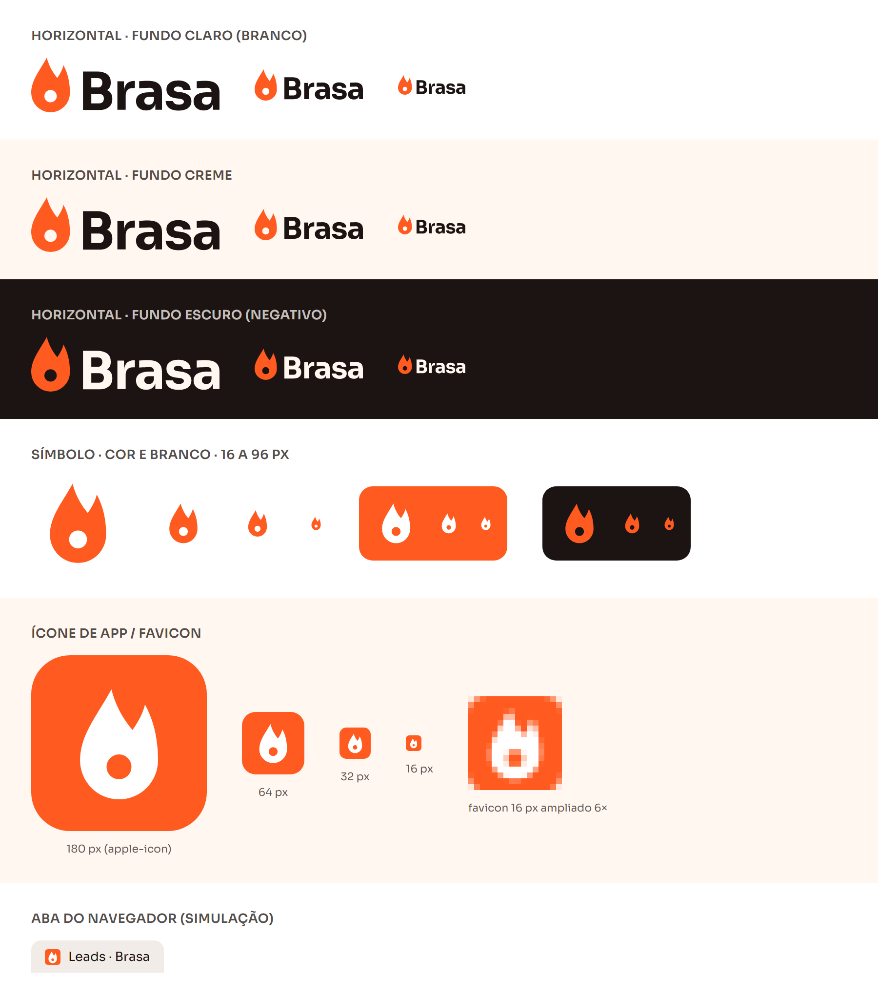

# Identidade visual: Brasa

Guia da marca do produto (antes chamado LeadScore IA). Vale para o
aplicativo, a página pública de captação, o material de venda e a
apresentação. Os valores aqui são os mesmos do código
(`src/app/globals.css`) e têm o contraste verificado por teste automatizado
(`tests/unit/identidade.test.ts`).

## 1. Conceito

| | |
|---|---|
| **Nome** | Brasa |
| **Descrição** | Brasa · qualificação de leads com IA |
| **Slogan** | Seus leads mais quentes, primeiro. |
| **Ideia** | O lead "em brasa" é o que deve ser atendido primeiro. A marca nasce da mesma escala térmica que classifica os leads: quente, morno e frio. |
| **Símbolo** | Chama estilizada, simples e geométrica (ver seção 9). |
| **Tom de voz** | Enérgico, direto, em português do Brasil, sem jargão. |

### Tom de voz na prática

| Faça | Evite |
|---|---|
| "3 leads quentes esperando resposta." | "Otimize seu pipeline com insights acionáveis." |
| "Analisar lead" | "Executar processamento de qualificação" |
| "Não conseguimos salvar. Tente de novo." | "Erro 500: falha na operação." |
| "Responder no WhatsApp" | "Iniciar interação via canal de mensageria" |
| Frases curtas, verbo no início, números concretos. | Anglicismos (*lead scoring*, *insights*) quando há palavra em português. |

## 2. Paleta base

| Cor | Hex | Papel |
|---|---|---|
| **Brasa** | `#FF5A1F` | Cor da marca: símbolo, ícones, destaques, elementos grandes |
| **Âmbar** | `#FFB020` | Secundária: realces e ações secundárias (sempre com texto carvão) |
| **Carvão** | `#1C1412` | Texto principal e fundo do tema escuro |
| **Creme** | `#FFF7F0` | Fundo do tema claro |

## 3. Escalas (50 a 950)

Geradas em OKLCH, o mesmo espaço de cor do Tailwind v4, a partir das cores
base (em negrito, preservadas exatamente). O brasa-600 foi ajustado para que
o texto branco sobre ele passe no contraste mínimo.

| Escala | 50 | 100 | 200 | 300 | 400 | 500 | 600 | 700 | 800 | 900 | 950 |
|---|---|---|---|---|---|---|---|---|---|---|---|
| Brasa | #FFF5F0 | #FFE9DD | #FFD3BF | #FFB699 | #FF8D66 | **#FF5A1F** | #D63A00 | #B62B00 | #972306 | #79200C | #470E04 |
| Âmbar | #FFFAEE | #FFF0D1 | #FFE3AB | #FFCF7D | **#FFB020** | #EE9000 | #D27000 | #AE5200 | #8D400B | #733511 | #441C06 |
| Carvão | **#FFF7F0** | #F7EEE9 | #E8DDD8 | #D4C8C2 | #AEA29B | #897D77 | #6D625D | #564C47 | #403732 | #2E2622 | **#1C1412** |
| Gelo (frio) | #F3F7FC | #E7EEF5 | #D2DEEA | #B7CADC | #8EA8C2 | #5B7A99 | #496685 | #3A5370 | #2E425C | #24354B | #111E2E |
| Erro | #FFF2F0 | #FFE2DF | #FFCAC7 | #FFA5A2 | #FE6A6F | #EC4053 | #D4193C | #AF0A31 | #8E0E27 | #751623 | #440811 |
| Sucesso | #EFFAF2 | #DCF4E3 | #BFEBCD | #96DCB0 | #66C58F | #3AAC72 | #15935B | #007548 | #00603B | #064E31 | #002C1A |

A escala **Carvão** é a neutra da interface: vai do Creme (50) ao Carvão
(950), de modo que até os cinzas têm o tom quente da marca.

## 4. Tokens semânticos e contraste

Os componentes usam **tokens semânticos** (ex.: `bg-superficie`,
`text-texto-suave`), nunca hex nem escalas diretamente. Assim o tema troca sem
mudar nenhum componente.

Mínimos WCAG 2.2 AA: **4,5:1** para texto comum; **3:1** para texto grande,
ícones, bordas de campos, foco e gráficos.

| Token | Claro | Escuro | Contraste (claro / escuro) | Uso |
|---|---|---|---|---|
| `fundo` | carvão-50 #FFF7F0 | carvão-950 #1C1412 | — | Fundo da página |
| `superficie` | #FFFFFF | carvão-900 #2E2622 | — | Cards, menu lateral, menu do topo |
| `superficie-2` | carvão-100 | carvão-800 | — | Linha em foco, áreas neutras |
| `texto` | carvão-950 | carvão-50 | 17,1 / 17,1 (sobre o fundo) | Texto principal |
| `texto-suave` | carvão-600 #6D625D | carvão-400 #AEA29B | 5,57 / 5,96 | Texto secundário |
| `borda` | carvão-200 | carvão-800 | decorativa | Divisórias |
| `borda-campo` | carvão-500 #897D77 | carvão-500 | 3,76 / 3,72 | Contorno de campos |
| `primaria` + `texto-primaria` | brasa-600 + branco | brasa-600 + branco | 4,70 / 4,70 | Botão principal |
| `primaria-hover` | brasa-700 | brasa-700 | 6,30 / 6,30 | Botão principal com o mouse em cima |
| `marca-texto` | brasa-700 #B62B00 | brasa-400 #FF8D66 | 5,94 / 6,53 | Links e textos da marca |
| `destaque` | brasa-500 #FF5A1F | brasa-500 | 3,12 / 4,75 (sobre a superfície) | Ícones e destaques |
| `secundaria` + `texto-secundaria` | âmbar-400 + carvão | âmbar-400 + carvão | 9,91 / 9,91 | Ação secundária |
| `foco` | brasa-600 | brasa-400 | 4,70 / 6,53 | Contorno de foco (2px, afastado 2px) |
| `erro` | erro-700 #AF0A31 | erro-300 #FFA5A2 | 7,22 / 7,88 | Texto de erro |
| `erro-fundo` + `erro-alerta` | erro-50 + erro-700 | erro-950 + erro-200 | 6,60 / 11,27 | Caixa de alerta |
| `destrutivo` + `texto-destrutivo` | erro-700 + branco | erro-700 + branco | 7,22 / 7,22 | Excluir, anonimizar |
| `sucesso` + `sucesso-fundo` | sucesso-700 + sucesso-50 | sucesso-300 + sucesso-950 | 5,39 / alto | Confirmações |

### O laranja da marca

| Uso do #FF5A1F | Contraste | Pode? |
|---|---|---|
| Ícone ou destaque sobre a superfície branca | 3,12:1 | ✅ |
| Ícone ou destaque sobre o tema escuro | 4,75:1 | ✅ |
| Texto grande (a partir de 24px, ou 19px em negrito) | 3,12:1 | ✅ |
| Texto comum sobre o branco | 3,12:1 | ❌ use `marca-texto` (brasa-700) |
| Ícone sobre o **creme** (`fundo`) | 2,94:1 | ❌ use brasa-600 (4,44:1) |
| Fundo de botão com texto branco | 3,12:1 | ❌ o botão usa brasa-600 (4,70:1) |

## 5. Classificação dos leads (escala térmica)

A classificação **nunca é comunicada só pela cor**: todo badge tem ícone e
palavra, e todo gráfico tem legenda ou rótulo.

| | Ícone | Badge claro (fundo / texto / ícone) | Badge escuro | Gráfico claro / escuro |
|---|---|---|---|---|
| **Quente** | chama | brasa-100 / brasa-800 (7,02) / brasa-600 (4,02) | brasa-950 / brasa-200 (11,5) / brasa-400 | brasa-600 / brasa-500 |
| **Morno** | termômetro | âmbar-100 / âmbar-800 (6,49) / âmbar-700 (4,65) | âmbar-950 / âmbar-200 (11,9) / âmbar-400 | âmbar-400 com contorno âmbar-700 / âmbar-400 |
| **Frio** | floco de neve | gelo-100 / gelo-800 (8,75) / gelo-600 (5,09) | gelo-950 / gelo-200 (12,3) / gelo-300 | gelo-600 / gelo-400 |

Tokens: `quente-fundo`, `quente-texto`, `quente-icone`, `quente-grafico` (e o
mesmo para `morno` e `frio`, mais `morno-grafico-contorno`).

### Daltonismo

As cores do gráfico foram escolhidas por simulação de protanopia,
deuteranopia e tritanopia (modelo de Machado et al., 2009). Uma primeira
versão (laranja médio × âmbar escuro) ficava **indistinguível para quem tem
protanopia**. A versão final separa as três cores também por
**luminosidade**, que o daltonismo preserva:

| Par (gráfico, tema claro) | Normal | Protanopia | Deuteranopia | Tritanopia |
|---|---|---|---|---|
| Quente × morno | 26,5 | 29,6 | 23,1 | 22,9 |
| Quente × frio | 26,4 | 15,6 | 21,0 | 31,8 |
| Morno × frio | 38,5 | 32,9 | 39,8 | 34,6 |

Distância perceptual ΔE OKLab × 100; acima de ~10 as cores são fáceis de distinguir.

### Erro não é marca

O vermelho de erro é **carmim escuro** (erro-700, #AF0A31), longe do laranja
da marca também para daltônicos (distância de 9 a 12 nos três tipos). Além
disso, o erro sempre vem com ícone de alerta e texto, e o laranja da marca
nunca é usado em alertas.

## 6. Tipografia

| | |
|---|---|
| **Fonte** | Sora (Google Fonts), variável, pesos 100 a 800, subconjuntos `latin` e `latin-ext` (acentos e cedilha) |
| **Carregamento** | `next/font/google`: a fonte é baixada no build e servida pelo próprio domínio, sem requisição ao Google no navegador |
| **Números** | A Sora tem algarismos de largura fixa: use `tabular-nums` em tabelas, scores e KPIs para os números alinharem |

| Nível | Tamanho / altura da linha | Peso | Uso |
|---|---|---|---|
| `text-xs` | 12 / 16px | 400–500 | Legendas (nunca menor que isso) |
| `text-sm` | 14 / 20px | 400–500 | Tabelas, rótulos de campo, menu |
| `text-base` | **16 / 24px** | 400 | Corpo de texto |
| `text-lg` | 18 / 28px | 500–600 | Destaques |
| `text-xl` | 20 / 28px | 600 | Título de card |
| `text-2xl` | 24 / 32px | 600 | Título de página |
| `text-3xl` | 30 / 36px | 700 | Números de KPI |
| `text-4xl` | 36 / 40px | 700 | Página pública |

Títulos (`h1` a `h3`) têm espaçamento entre letras de −0,01em.

## 7. Espaçamento, forma e profundidade

| Token | Valor | Uso |
|---|---|---|
| Espaçamento base | 4px (padrão do Tailwind) | Entre elementos: 8, 12, 16px; dentro de cards: 24px; entre seções: 32, 48px |
| `h-controle` | 40px (44px em telas de toque) | Altura de botões e campos |
| `rounded-sm` | 6px | Elementos internos pequenos |
| `rounded-md` | 10px | Botões e campos |
| `rounded-lg` | 14px | Cards |
| `rounded-xl` | 20px | Modais |
| `rounded-full` | — | Avatar, badges em pílula |
| `shadow-sm` | `0 1px 2px rgb(28 20 18 / .06)` | Cards em repouso |
| `shadow-md` | `0 4px 12px -2px rgb(28 20 18 / .10)` | Menus suspensos |
| `shadow-lg` | `0 12px 32px -8px rgb(28 20 18 / .18)` | Modais |

No tema escuro, a profundidade vem de superfícies mais claras (fundo 950 →
superfície 900 → superfície-2 800) e de bordas, não de sombras.

## 8. Temas

| Tema | Quando |
|---|---|
| **Claro** | Padrão do produto |
| **Escuro** | Escolhido pelo usuário |
| **Sistema** | Segue a preferência do sistema operacional |

A escolha fica no cookie `tema` e é aplicada pelo servidor no atributo
`data-tema` do `<html>`. A página chega com as cores certas: sem "piscada"
de tema e sem script inline (bloqueado pela CSP). Valores inválidos no cookie
caem no tema claro.

Também fazem parte da base: foco sempre visível no teclado e animações
desligadas para quem ativou "reduzir movimento" no sistema.

## 9. Logotipo

**Símbolo:** chama geométrica de duas pontas com a **brasa** (círculo) ao
centro. As duas pontas e o círculo diferenciam o desenho de outras marcas com
chama e ligam o símbolo ao nome. **Nome:** "Brasa" em Sora Bold, convertido em
curvas (o arquivo não depende da fonte instalada; a licença OFL da Sora
permite esse uso).

| Arquivo (`public/marca/`) | Quando usar |
|---|---|
| `brasa-horizontal.svg` | Versão principal, sobre fundo claro (nome em carvão) |
| `brasa-horizontal-negativo.svg` | Sobre fundo escuro (nome em creme) |
| `brasa-simbolo.svg` | Espaços pequenos ou quadrados (avatar, redes sociais) |
| `brasa-simbolo-branco.svg` | Sobre o laranja da marca ou sobre fotos |
| `brasa-app.svg` | Ícone de app (quadrado arredondado laranja com a chama branca) |
| `brasa-favicon.svg` | Favicon: a chama ocupa 90% para ficar legível em 16px |

No app, use o componente `Logo` (`src/components/marca/Logo.tsx`): o nome
troca sozinho de cor entre os temas. Os ícones do Next.js (`src/app/icon.svg`,
`apple-icon.png`, `favicon.ico`) são gerados por `npm run marca:icones`.

| Regra | Valor |
|---|---|
| Área de proteção | Espaço livre em volta igual a metade da altura da chama |
| Tamanho mínimo, horizontal | 20px de altura na tela |
| Tamanho mínimo, símbolo | 16px |

Não faça: distorcer ou girar o logotipo; trocar a cor da chama (a única
alternativa é a versão branca); aplicar sombra, contorno ou degradê;
colocar a chama laranja sobre fundo laranja ou âmbar (use a versão branca);
reescrever o nome com outra fonte.

## 10. Faça e não faça

| Faça | Não faça |
|---|---|
| Use tokens semânticos (`bg-primaria`, `text-texto-suave`) | Escrever hex ou `brasa-500` direto nos componentes |
| Use `marca-texto` (brasa-700) para links | Usar #FF5A1F em texto comum |
| Coloque ícones #FF5A1F sobre a superfície branca ou o tema escuro | Colocar #FF5A1F sobre o creme |
| Mostre a classificação com ícone, palavra e cor | Indicar quente, morno ou frio só pela cor |
| Use carmim (`erro`) com ícone de alerta para erros | Usar o laranja da marca para alertas |
| Use âmbar como fundo, com texto carvão | Usar âmbar como cor de texto |
| Use `tabular-nums` em números de tabelas e KPIs | Deixar colunas de números desalinhadas |
| Mantenha o tom direto: verbo e números concretos | Jargão e anglicismos desnecessários |

## 11. Componentes e telas

| Componente | Uso |
|---|---|
| `Logo` | Logotipo em SVG embutido. `variante="simbolo"` para só a chama; `decorativo` quando o nome "Brasa" já estiver escrito ao lado |
| `BadgeClassificacao` | Quente, morno, frio ou "Sem análise", sempre com ícone, palavra e cor |
| Ícones | Biblioteca `lucide-react`, uma só família em todo o produto. Ícone ao lado de texto: `aria-hidden="true"`. Botão só com ícone: nome acessível (`aria-label`) |

### Regras para as telas que ainda serão criadas

Estas telas ainda não existem e devem seguir a identidade ao serem criadas:

- **Área logada (Etapa 4):** menu lateral esquerdo e menu superior na
  `superficie` (branco no claro, carvão-900 no escuro), com o `Logo` no topo
  do menu lateral; item ativo com `marca-texto` e um indicador além da cor
  (barra lateral ou peso da fonte); link "Pular para o conteúdo" como primeiro
  elemento focável; avatar com submenu acessível por teclado.
- **Formulário público `/f/[slug]` (Etapa 6):** fundo `fundo`, cartão em
  `superficie`, rótulos visíveis acima dos campos (nunca só placeholder),
  `borda-campo` nos campos, erro ao lado do campo com ícone, botão `primaria`
  com altura `h-controle`, e o `Logo` discreto no rodapé ("feito com Brasa").
- **Painel (Etapa 7):** badges com `BadgeClassificacao`, números com
  `tabular-nums`, gráficos com as cores `*-grafico` e legenda ou rótulo
  sempre visível.

## 12. Como a acessibilidade é garantida

- `tests/unit/identidade.test.ts` lê o `globals.css`, resolve os tokens nos
  dois temas e confere 28 pares de contraste. O CI reprova qualquer mudança
  de cor que quebre o mínimo.
- O mesmo teste garante que o tema "sistema" usa exatamente os tokens do
  tema escuro.
- `tests/e2e/identidade.spec.ts` confere no navegador a fonte Sora e os temas.
- A paleta padrão do Tailwind foi removida: só as cores da marca existem.
